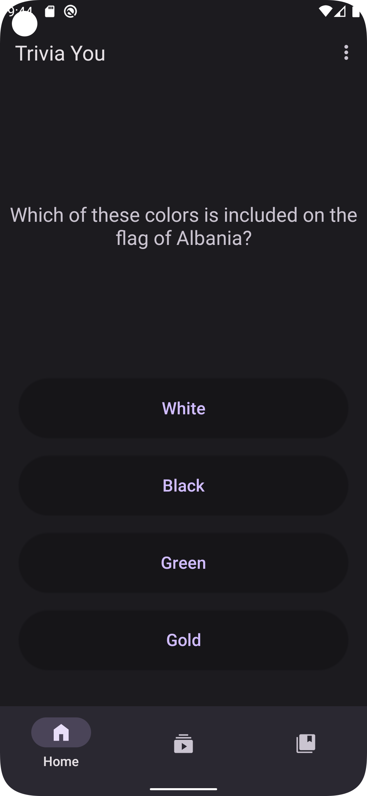
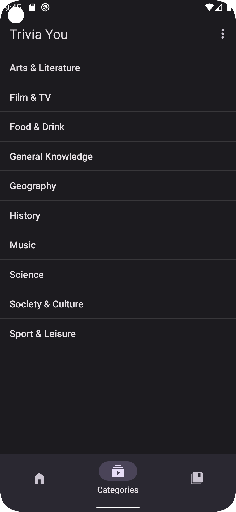
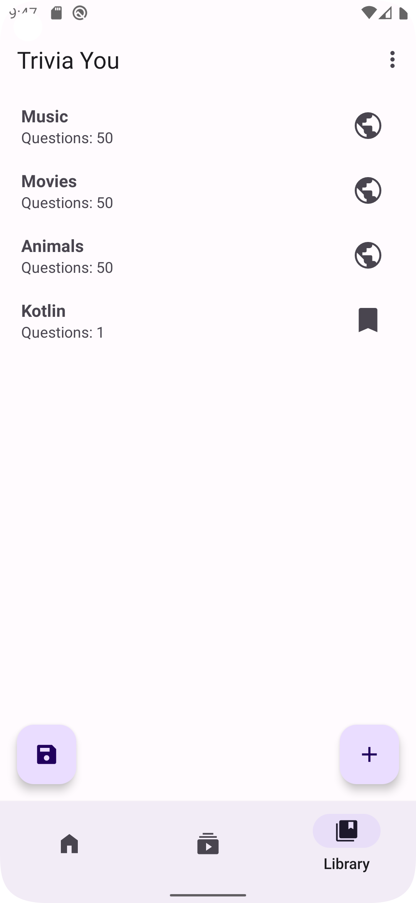
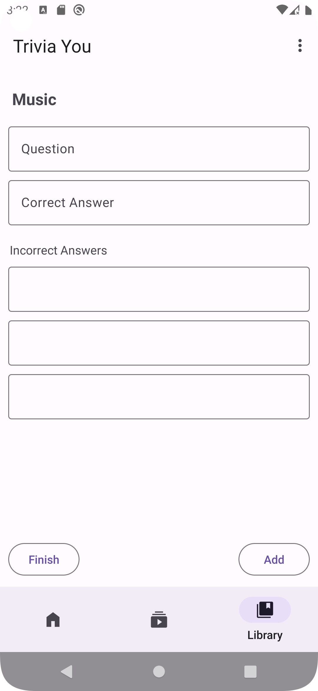
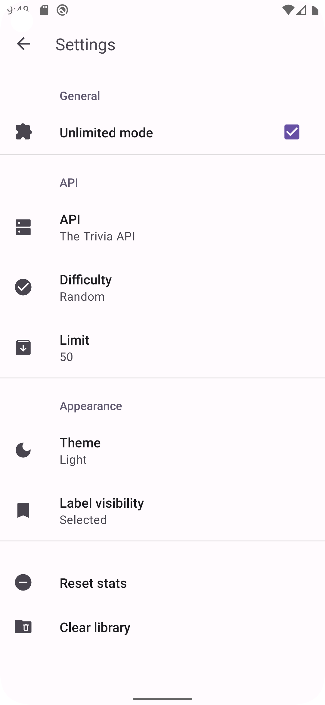

  
  <h1>Trivia You</h1>
  
Trivia You is a Trivia App which user the design style of <a href="https://m3.material.io/">Material Design 3 (You)</a>.

  

    
    
    
    
    
     

## Features

- [x] Support for different Quiz APIs
    - [x] Categories
    - [x] Different difficulties
    - [x] API Stats
      
- [x] Local
    - [x] Creating and playing custom quizzes
    - [x] Storing API questions locally to play without Internet
    - [x] User stats

## Download

## Screenshots

## Supported APIs

- [x] [The Trivia API](https://the-trivia-api.com/)
- [x] [Open Trivia DB](https://opentdb.com/)

## Contribution

All contributions are welcome!
Feel free to suggest new features or new APIs that could be supported.
If you are a developer and wish to contribute to the app, please to fork the project and submit a pull request.

## Translation

## Credits
- Logo by [@XelXen](https://github.com/XelXen)

## License

Trivia You is licensed under the [GNU General Public License](https://www.gnu.org/licenses/gpl.html): You can use, study and share it as you want.
